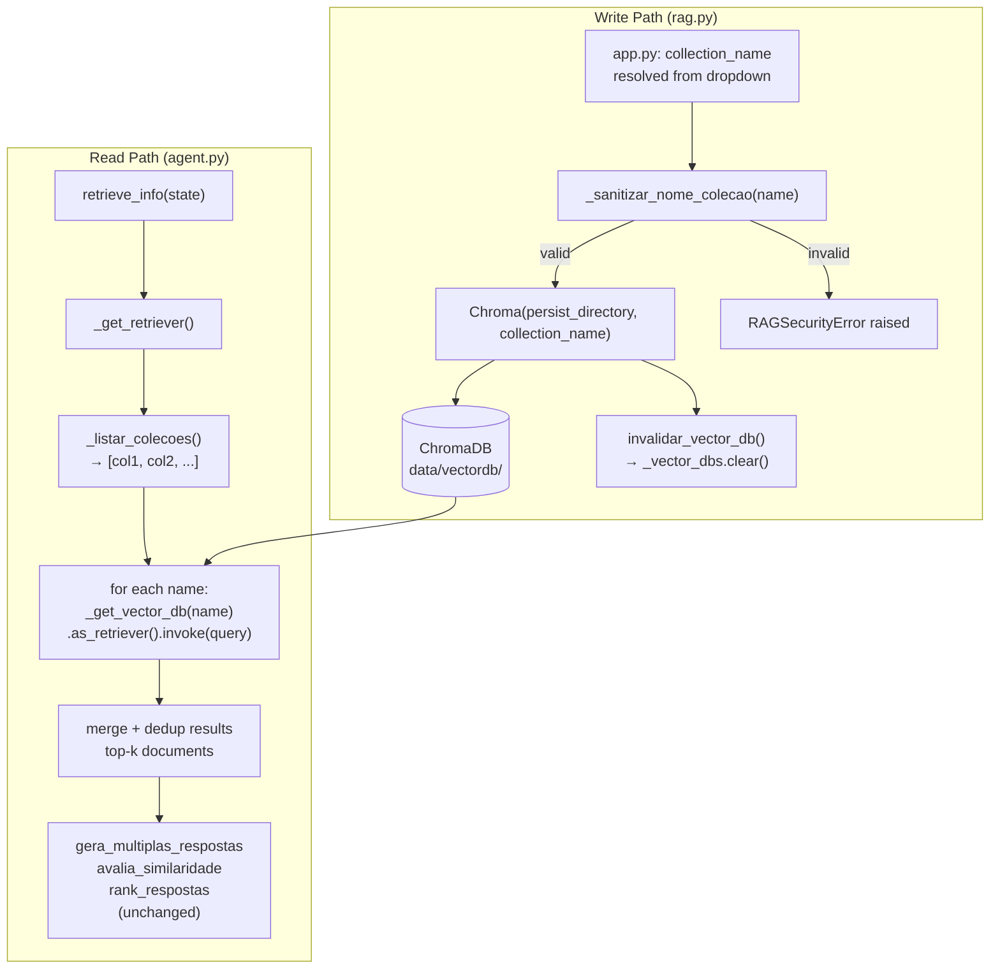

# Multi-Collection ChromaDB — Design

**Spec:** `.specs/features/multi-collection-chromadb/spec.md`
**Status:** Awaiting human approval

---

## Architecture Overview

The change is a two-sided extension of the existing singleton pattern:

- **Write side (rag.py):** every `Chroma(...)` constructor call gains a `collection_name` parameter, validated by the new `_sanitizar_nome_colecao()` gate. No new abstractions needed.
- **Read side (agent.py):** the single `_vector_db: Chroma | None` singleton becomes `_vector_dbs: dict[str, Chroma]`. A new helper `_listar_colecoes()` enumerates existing collections from the ChromaDB client; `_get_retriever()` fans out across all of them and merges results before returning.
- **UI (app.py):** the "Adicionar Documento" expander gains a collection selector. Fetches collection names at render time via the same `_listar_colecoes()` logic (or a thin wrapper around it). No new Streamlit pages or routes.



---

## Code Reuse Analysis

### Existing Components to Leverage

| Component | Location | How to Use |
|-----------|----------|------------|
| `_sanitizar_nome_arquivo()` | `src/agenticlog/rag.py:151` | Direct model for `_sanitizar_nome_colecao()` — same raise-on-violation pattern |
| `RAGSecurityError` | `src/agenticlog/rag.py:66` | Reuse unchanged for all collection name validation failures |
| `_get_vector_db()` singleton pattern | `src/agenticlog/agent.py:110` | Extend to dict-keyed version; same lazy-init logic per key |
| `invalidar_vector_db()` | `src/agenticlog/agent.py:148` | Change body from `_vector_db = None` to `_vector_dbs.clear()` |
| `_get_rag_embedding_model()` | `src/agenticlog/rag.py:53` | Unchanged; reused by all `Chroma(...)` constructor calls |
| `INVALID_FILENAME_CHARS`, `WINDOWS_RESERVED_NAMES` | `src/agenticlog/config.py` | Not reused for collection names — ChromaDB rules differ from filename rules; new constants needed |
| `st.rerun()` after ingestion | `app.py:83,98` | Already handles stale state after document upload; collection list will also refresh |

### Integration Points

| System | Integration Method |
|--------|--------------------|
| ChromaDB via `langchain-chroma` | `Chroma(persist_directory, collection_name, embedding_function)` — `collection_name` param already supported; see risk note about `list_collections()` |
| LangGraph agent nodes | `retrieve_info()` calls `_get_retriever()`; downstream nodes are unchanged; fan-out is entirely inside `_get_retriever()` |
| FastAPI `_verificar_vectordb()` | Replace implicit collection open with `Chroma(..., collection_name=DEFAULT_COLLECTION_NAME, ...)` |

---

## Components

### `_sanitizar_nome_colecao(name: str) -> str`

- **Purpose:** Validate a collection name against ChromaDB naming rules and project constants before any write operation.
- **Location:** `src/agenticlog/rag.py` (new function, near `_sanitizar_nome_arquivo`)
- **Interfaces:**
  - `_sanitizar_nome_colecao(name: str) -> str` — returns `name` unchanged if valid; raises `RAGSecurityError` otherwise.
- **Dependencies:** `COLLECTION_NAME_MIN_LEN`, `COLLECTION_NAME_MAX_LEN`, `COLLECTION_NAME_PATTERN` from `config.py`; `RAGSecurityError`.
- **Reuses:** Same raise-on-violation structure as `_sanitizar_nome_arquivo()`.

**Validation rules (in order):**
1. Empty string → `RAGSecurityError("Nome de coleção vazio.")`.
2. `len(name) < COLLECTION_NAME_MIN_LEN` → `RAGSecurityError(f"Nome de coleção muito curto: mínimo {COLLECTION_NAME_MIN_LEN} caracteres.")`.
3. `len(name) > COLLECTION_NAME_MAX_LEN` → `RAGSecurityError(f"Nome de coleção muito longo: máximo {COLLECTION_NAME_MAX_LEN} caracteres.")`.
4. `not COLLECTION_NAME_PATTERN.match(name)` → `RAGSecurityError(f"Nome de coleção inválido: use apenas letras, números, hífen e underscore, começando e terminando com alfanumérico.")`.

**Regex pattern:** `^[a-zA-Z0-9][a-zA-Z0-9_-]*[a-zA-Z0-9]$`

Note: This pattern requires at least 2 characters (start anchor + end anchor). Combined with the min-length check of 3, a name of exactly 3 characters like `"abc"` passes: start=`a`, middle=`b` (matched by `[a-zA-Z0-9_-]*`), end=`c`. The `*` quantifier (zero or more) handles the minimum case correctly.

---

### Updated `adicionar_documento_incrementalmente`

- **Purpose:** Accept optional `collection_name`; pass it to every `Chroma(...)` constructor call within the function.
- **Location:** `src/agenticlog/rag.py:231`
- **Interfaces:**
  - `adicionar_documento_incrementalmente(filename: str, conteudo: bytes, collection_name: str = DEFAULT_COLLECTION_NAME) -> dict[str, str]`
- **Dependencies:** `_sanitizar_nome_colecao()` (called first); `Chroma(persist_directory, collection_name, embedding_function)`.
- **Reuses:** All existing logic unchanged; only the `Chroma(...)` constructor gains `collection_name`.

---

### Updated `salvar_documento_enviado` and `salvar_pdf_enviado`

- **Purpose:** Accept optional `collection_name`; validate it; pass through to callers.
- **Location:** `src/agenticlog/rag.py`
- **Interfaces:**
  - `salvar_documento_enviado(filename: str, conteudo: bytes, collection_name: str = DEFAULT_COLLECTION_NAME) -> Path`
  - `salvar_pdf_enviado(filename: str, conteudo: bytes, collection_name: str = DEFAULT_COLLECTION_NAME) -> Path`
- **Note:** These functions save the file to disk but do not directly call `Chroma()`. The `collection_name` is validated here and stored so the caller (`app.py`) can pass it to subsequent ingestion calls. `salvar_pdf_enviado` does not call `cria_vectordb` internally — `app.py` calls `reconstruir_vectordb(collection_name)` separately.

---

### Updated `cria_vectordb` / `reconstruir_vectordb`

- **Purpose:** Accept `collection_name` to create/rebuild a specific collection.
- **Location:** `src/agenticlog/rag.py`
- **Interfaces:**
  - `cria_vectordb(collection_name: str = DEFAULT_COLLECTION_NAME) -> None`
  - `reconstruir_vectordb(collection_name: str = DEFAULT_COLLECTION_NAME) -> None`
- **Change:** `Chroma.from_documents(..., collection_name=collection_name)` replaces the current call with no `collection_name`.

---

### `_vector_dbs` dict + `_get_vector_db(collection_name)` in agent.py

- **Purpose:** Replace the single `_vector_db: Chroma | None` singleton with a per-collection cache.
- **Location:** `src/agenticlog/agent.py`
- **Interfaces:**
  - Module-level: `_vector_dbs: dict[str, Chroma] = {}`
  - `_get_vector_db(collection_name: str) -> Chroma` — returns cached instance or creates new `Chroma(persist_directory=str(DIR_VECTORDB), collection_name=collection_name, embedding_function=_get_embedding_model())`.
- **Dependencies:** `DIR_VECTORDB`, `_get_embedding_model()`, `Chroma`.
- **Reuses:** Same lazy-singleton pattern as the current `_get_vector_db()`.

---

### `_listar_colecoes()` in agent.py

- **Purpose:** Return the list of collection names currently present in the ChromaDB persist directory.
- **Location:** `src/agenticlog/agent.py`
- **Interfaces:**
  - `_listar_colecoes() -> list[str]` — returns list of collection name strings; returns `[DEFAULT_COLLECTION_NAME]` if ChromaDB returns no collections or raises.
- **Implementation note:** Use `chromadb.PersistentClient(path=str(DIR_VECTORDB)).list_collections()` to get the raw collection objects, then extract `.name` from each. Import `chromadb` lazily inside the function to avoid import-time side effects.
- **Fallback:** If `list_collections()` raises or returns empty, return `[DEFAULT_COLLECTION_NAME]` so the agent always attempts at least one collection.

---

### Updated `_get_retriever()` — Fan-out

- **Purpose:** Retrieve documents from all collections, merge, and return top results.
- **Location:** `src/agenticlog/agent.py`
- **Interfaces:**
  - `_get_retriever()` — no signature change (called by `retrieve_info()` which is unchanged).
- **Returns:** A callable that accepts a query string and returns `list[Document]`.
- **Implementation:**

```python
def _get_retriever():
    collection_names = _listar_colecoes()
    all_docs: list[Document] = []
    for name in collection_names:
        try:
            db = _get_vector_db(name)
            retriever = db.as_retriever(search_type="similarity", search_kwargs={"k": 3})
            docs = retriever.invoke(query)   # NOTE: query must be passed — see note below
            all_docs.extend(docs)
        except Exception:
            raise  # AC18: propagate ChromaDB errors immediately
    # deduplicate by page_content hash; return top 3 overall
    seen: set[str] = set()
    unique_docs = []
    for doc in all_docs:
        key = hashlib.md5(doc.page_content.encode()).hexdigest()  # nosec B324
        if key not in seen:
            seen.add(key)
            unique_docs.append(doc)
    return unique_docs[:3]
```

**Design note:** The current `_get_retriever()` returns a retriever object that `retrieve_info()` calls with `state.query`. The fan-out implementation must instead return a callable or change `retrieve_info()` slightly. The cleanest approach: change `_get_retriever()` to accept `query: str` and return `list[Document]` directly; update `retrieve_info()` to call `_get_retriever(state.query)`. This is a contained change with no impact on LangGraph nodes downstream.

---

### Updated `invalidar_vector_db()`

- **Purpose:** Clear all cached Chroma instances so the next retrieval reconnects.
- **Location:** `src/agenticlog/agent.py`
- **Change:** Replace `global _vector_db; _vector_db = None` with `_vector_dbs.clear()`.
- **Thread safety:** Streamlit is single-threaded per session; FastAPI is async but `invalidar_vector_db()` is only called from `adicionar_documento_incrementalmente` after a successful write. Acceptable for current architecture.

---

### Updated `inicializar_recursos()`

- **Purpose:** Pre-warm singletons at FastAPI startup.
- **Location:** `src/agenticlog/agent.py`
- **Change:** Replace `_get_vector_db()` call (which used no `collection_name`) with `_get_vector_db(DEFAULT_COLLECTION_NAME)`. Import `DEFAULT_COLLECTION_NAME` from `config`.

---

### `app.py` — Collection Selector UI

- **Purpose:** Allow operator to choose or create a collection name before document upload.
- **Location:** `app.py`, inside the `with st.sidebar.expander("Adicionar Documento"):` block.
- **Implementation:**

```python
# 1. Fetch existing collections for dropdown
from agenticlog.agent import _listar_colecoes  # or thin wrapper

NOVA_COLECAO_SENTINEL = "Nova coleção…"

colecoes_existentes = _listar_colecoes()
opcoes = colecoes_existentes + [NOVA_COLECAO_SENTINEL]
selecao = st.selectbox("Coleção", opcoes)

if selecao == NOVA_COLECAO_SENTINEL:
    nome_colecao_input = st.text_input("Nome da nova coleção")
    # inline validation feedback
    if nome_colecao_input:
        try:
            from agenticlog.rag import _sanitizar_nome_colecao
            _sanitizar_nome_colecao(nome_colecao_input)
            st.caption("Nome válido.")
        except RAGSecurityError as e:
            st.caption(f"Nome inválido: {e}")
    collection_name = nome_colecao_input
else:
    collection_name = selecao
```

- **`_ingerir_documento()` signature update:** add `collection_name: str` parameter; pass to all ingestion calls.
- **Success message update:** include collection name in `st.success(...)` output.

---

## Data Models

No new Pydantic models. The only structural change is the module-level variable in `agent.py`:

**Before:**
```python
_vector_db: Chroma | None = None
```

**After:**
```python
_vector_dbs: dict[str, Chroma] = {}
```

**New config constants:**
```python
# src/agenticlog/config.py
import re

DEFAULT_COLLECTION_NAME: str = "logistica"
COLLECTION_NAME_MIN_LEN: int = 3
COLLECTION_NAME_MAX_LEN: int = 63
COLLECTION_NAME_PATTERN: re.Pattern[str] = re.compile(
    r"^[a-zA-Z0-9][a-zA-Z0-9_-]*[a-zA-Z0-9]$"
)
```

---

## Error Handling Strategy

| Error Scenario | Handling | User Impact |
|----------------|----------|-------------|
| Collection name < 3 chars | `RAGSecurityError` raised in `_sanitizar_nome_colecao()`; UI catches with `st.error()` | Inline error message in sidebar |
| Collection name > 63 chars | Same as above | Same |
| Invalid chars or start/end | Same as above | Same |
| ChromaDB error during fan-out | Exception re-raised from `_get_retriever()`; propagates to FastAPI; returns HTTP 500 | Generic error message in UI query response |
| Empty collection during fan-out | 0 docs contributed; silently skipped | No visible impact; query may return fewer results |
| `_listar_colecoes()` failure | Returns `[DEFAULT_COLLECTION_NAME]` as fallback | Agent queries at least one collection; degraded but functional |
| `invalidar_vector_db()` on empty dict | `dict.clear()` on empty dict — no exception | No impact |

---

## Tech Decisions

| Decision | Choice | Rationale |
|----------|--------|-----------|
| Fan-out deduplication method | MD5 of `page_content` | Fast, no external deps; collisions acceptable for document dedup at this scale; `# nosec B324` comment required for bandit |
| `_get_retriever()` signature change | Accept `query: str`, return `list[Document]` directly | Avoids returning a "meta-retriever" wrapper object; simpler than composing multiple retrievers |
| `_listar_colecoes()` fallback | Return `[DEFAULT_COLLECTION_NAME]` on failure | Keeps the agent functional even if ChromaDB client list fails; logs warning |
| Collection name regex | `^[a-zA-Z0-9][a-zA-Z0-9_-]*[a-zA-Z0-9]$` | Mirrors ChromaDB documented naming constraints; `*` allows exactly-3-char names |
| `DEFAULT_COLLECTION_NAME` value | `"logistica"` | Domain-appropriate; passes its own validation rules (8 chars, all alpha) |
| Import `chromadb` in `_listar_colecoes()` | Lazy import inside function body | Consistent with existing pattern in rag.py (`from agenticlog.agent import invalidar_vector_db` is lazy); avoids circular import risk |
