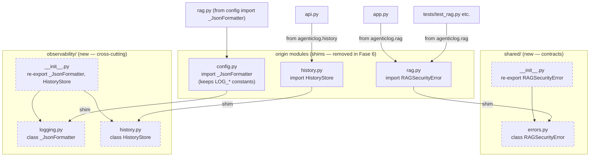

# RAG Shared + Observability Extraction — Design

**Spec:** `.specs/features/rag-shared-observability/spec.md`
**Related:** ADR-018 (Fase 2), `docs/arquitetura-alvo-rag.md` §3/§4, `.specs/codebase/CONCERNS.md`
**Status:** Awaiting human approval

---

## Architecture Overview

Three self-contained symbols move from mixed-concern modules into their ADR-018 target packages. Each origin module keeps a **re-export shim** so no consumer changes. Each new package `__init__.py` re-exports the symbol ergonomically. Object identity is preserved end-to-end because a shim is a plain `from <canonical> import <name>` that binds the origin namespace to the **same** class object (Python name binding, not a copy).



**Acyclicity invariant (the one real risk):** the dashed nodes (`shared/*`, `observability/*`) are **stdlib-only** and MUST NOT import `agenticlog.config`. `config.py` may import `observability.logging` (forward edge only). This keeps the import graph a DAG and prevents the `config → observability.logging → config` cycle.

---

## Code Reuse Analysis

### Existing Components to Leverage

| Component | Location | How to Use |
|-----------|----------|------------|
| `health.py` exception + `__init__` re-export precedent | `src/agenticlog/health.py`, `src/agenticlog/__init__.py` | Apply the same pattern: standalone module defines the symbol; package `__init__` re-exports with explicit `__all__`. |
| `RAGSecurityError` body | `src/agenticlog/rag.py` L87–92 | Move verbatim to `shared/errors.py` (plain `Exception` subclass, Portuguese docstring kept). |
| `_JsonFormatter` body | `src/agenticlog/config.py` L166–177 | Move verbatim to `observability/logging.py`; it already references no `LOG_*` symbol, only `json`/`logging`/`datetime`. |
| `HistoryStore` module | `src/agenticlog/history.py` (whole, 119 lines) | Move verbatim to `observability/history.py`; stdlib-only (`sqlite3`, `threading`, `logging`, `pathlib`). |
| Test conventions | `.specs/codebase/TESTING.md`, existing `tests/` | `unittest.TestCase`, `test_`/`teste_` naming, `tmp_path`/temp-file patterns, all deps mocked. |

### Integration Points

| System | Integration Method |
|--------|--------------------|
| `rag.py` runtime (raises `RAGSecurityError`, uses `_JsonFormatter` in `_configurar_logging_cli`) | Unchanged imports; symbols resolve via shims to canonical objects. |
| `api.py` (constructs `HistoryStore`) | Unchanged `from agenticlog.history import HistoryStore`; `@patch("agenticlog.api.HistoryStore")` still targets the consumer namespace. |
| `config.py` `LOG_*` constants | Stay in `config.py`; `_configurar_logging_cli` in `rag.py` keeps reading them from `config`. |

---

## Components

### `shared/errors.py`

- **Purpose**: Canonical home for domain exceptions, starting with `RAGSecurityError`.
- **Location**: `src/agenticlog/shared/errors.py`
- **Interfaces**:
  - `class RAGSecurityError(Exception)` — raised on path traversal, forbidden JSON keys, oversized files. Docstring and semantics identical to the original.
- **Dependencies**: stdlib only (none beyond builtin `Exception`).
- **Reuses**: `rag.py` L87–92 body verbatim; `health.py` module-per-exception pattern.

### `shared/__init__.py`

- **Purpose**: Package API; ergonomic re-export.
- **Location**: `src/agenticlog/shared/__init__.py`
- **Interfaces**: `from agenticlog.shared.errors import RAGSecurityError`; `__all__ = ["RAGSecurityError"]`.
- **Dependencies**: `shared.errors`.
- **Reuses**: `agenticlog/__init__.py` re-export precedent.

### `observability/logging.py`

- **Purpose**: JSON log formatter for structured logging.
- **Location**: `src/agenticlog/observability/logging.py`
- **Interfaces**:
  - `class _JsonFormatter(logging.Formatter)` with `format(record: logging.LogRecord) -> str` returning `json.dumps({timestamp, level, logger, message})`. Byte-identical output to the original.
- **Dependencies**: stdlib `json`, `logging`, `datetime`. **MUST NOT import `agenticlog.config`.**
- **Reuses**: `config.py` L166–177 body verbatim.

### `observability/history.py`

- **Purpose**: SQLite audit log store for query history.
- **Location**: `src/agenticlog/observability/history.py`
- **Interfaces** (unchanged from current `history.py`):
  - `HistoryStore(db_path: Path, max_entries: int)` — creates dir, table, write lock.
  - `init_db() -> None` — idempotent DDL.
  - `append(registro: dict) -> None` — thread-safe insert with FIFO eviction at `max_entries`.
  - `read_all(limit: int | None = None) -> list[dict]` — DESC-ordered rows.
- **Dependencies**: stdlib `sqlite3`, `threading`, `logging`, `pathlib`. **MUST NOT import `agenticlog.config`.**
- **Reuses**: whole current `history.py` body verbatim.

### `observability/__init__.py`

- **Purpose**: Package API; ergonomic re-exports.
- **Location**: `src/agenticlog/observability/__init__.py`
- **Interfaces**: `from agenticlog.observability.logging import _JsonFormatter`; `from agenticlog.observability.history import HistoryStore`; `__all__ = ["_JsonFormatter", "HistoryStore"]`.
- **Dependencies**: `observability.logging`, `observability.history` — both stdlib-only, so the package stays `config`-free (preserves acyclicity even though `config` imports this package).
- **Reuses**: `agenticlog/__init__.py` re-export precedent.

### `rag.py` (shim)

- **Purpose**: Backward-compatible re-export of `RAGSecurityError`.
- **Change**: Replace class definition (L87–92) with `from agenticlog.shared.errors import RAGSecurityError  # Re-export shim (ADR-018 Fase 2) — remover na Fase 6`. Existing `from agenticlog.config import _JsonFormatter` (L46) and all internal `raise RAGSecurityError(...)` sites are unchanged.
- **Dependencies added**: `agenticlog.shared.errors` (stdlib-only leaf → no cycle).

### `config.py` (shim)

- **Purpose**: Backward-compatible re-export of `_JsonFormatter`; keep log config constants.
- **Change**: Replace class definition (L166–177) with `from agenticlog.observability.logging import _JsonFormatter  # Re-export shim (ADR-018 Fase 2) — remover na Fase 6`. Keep `LOG_LEVEL`, `LOG_FORMAT`, `_VALID_LOG_LEVELS`, `_VALID_LOG_FORMATS` and their validation. Remove now-unused top-of-file imports `json` and `datetime` (verify with ruff; keep `logging` only if still used elsewhere).
- **Dependencies added**: `agenticlog.observability.logging` (stdlib-only leaf → no cycle).

### `history.py` (shim)

- **Purpose**: Backward-compatible re-export of `HistoryStore`.
- **Change**: Replace body with module docstring note + `from agenticlog.observability.history import HistoryStore  # Re-export shim (ADR-018 Fase 2) — remover na Fase 6`. Optionally `__all__ = ["HistoryStore"]`.
- **Dependencies added**: `agenticlog.observability.history` (stdlib-only leaf → no cycle).

---

## Data Models

No new or changed data models. The `HistoryStore` `query_history` table is relocated as-is:

```
query_history(
  id               INTEGER PRIMARY KEY AUTOINCREMENT,
  timestamp        TEXT NOT NULL,
  query            TEXT NOT NULL,
  next_step        TEXT NOT NULL,
  confidence_score REAL NOT NULL,
  ranked_response  TEXT NOT NULL
)
```

---

## Error Handling Strategy

| Error Scenario | Handling | Impact |
|----------------|----------|--------|
| Circular import introduced accidentally | Fresh-interpreter `import agenticlog` smoke test fails loudly (OBS-18) | Caught in CI/gate before merge; not shipped. |
| `config` reloaded but `observability.logging` not | Shim re-binds to loaded canonical attribute → identity preserved; assertion OBS-19 guards it | None (verified green). |
| `ruff` flags dead `json`/`datetime` in `config.py` | Remove the imports in the `config.py` shim task | None (lint clean). |
| Behavior drift in moved body | New per-symbol tests compare output/schema/semantics against expected | Regression caught by unit test, not in prod. |

---

## Tech Decisions (non-obvious only)

| Decision | Choice | Rationale |
|----------|--------|-----------|
| Where do `LOG_*` constants live | Stay in `config.py`; move only `_JsonFormatter` | Moving `LOG_*` into `observability.logging` would force `observability.logging` to import `config` (or vice-versa), creating the exact `config ↔ observability` cycle this feature must avoid. Checkpoint-1 confirmed. |
| Are `__init__` re-exports required | Yes, both `shared/__init__.py` and `observability/__init__.py` re-export | Ergonomic `from agenticlog.shared import RAGSecurityError`; matches `health.py` precedent. Identity assertions extend to these re-exports (Checkpoint-1). |
| Keep or drop shims | Keep at origin paths, marked for Fase 6 removal | ~638 references + `@patch` sites in the suite make an immediate cutover expensive and risky; shims decouple relocation from test rewrite. |
| Verbatim move vs refactor | Verbatim (no signature/body edits) | "No behavior change" is the primary success criterion; verbatim keeps the characterization oracle and `rag_eval` trivially green. |

---

## CONCERNS.md Mitigations

- **"No Logging Module" (MEDIUM)** — this feature advances the observability story by giving `_JsonFormatter` a dedicated `observability/logging.py` home; it does not regress it. No `print()` is introduced.
- No other CONCERNS.md item (startup error handling, LMStudio SPOF, hardcoded creds) is touched by this relocation; the design deliberately keeps runtime behavior byte-identical to avoid interacting with those fragile areas.

---

## Tips / Guardrails for Builders

- Move bodies **verbatim** — do not "improve" docstrings, fields, or SQL while moving.
- After the `config.py` shim, run `ruff` and delete any import it flags as unused (expected: `json`, `datetime`).
- Never add `import agenticlog.config` (or anything transitively importing it) to `shared/*` or `observability/*`.
- Do not reload `observability.logging` in tests; only `config` + `rag` are reloaded by the existing `_reload_rag` helper.
